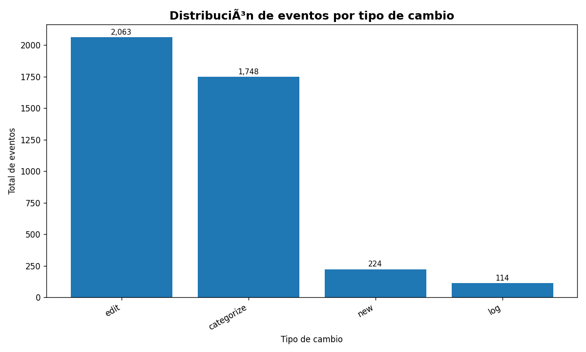
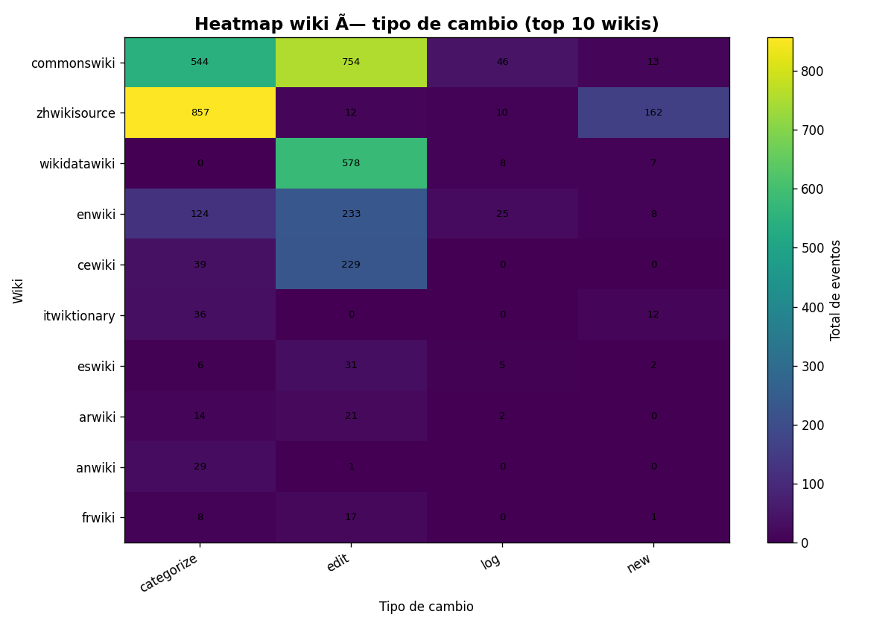
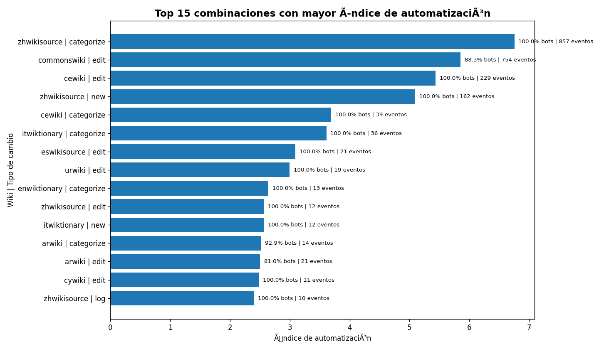
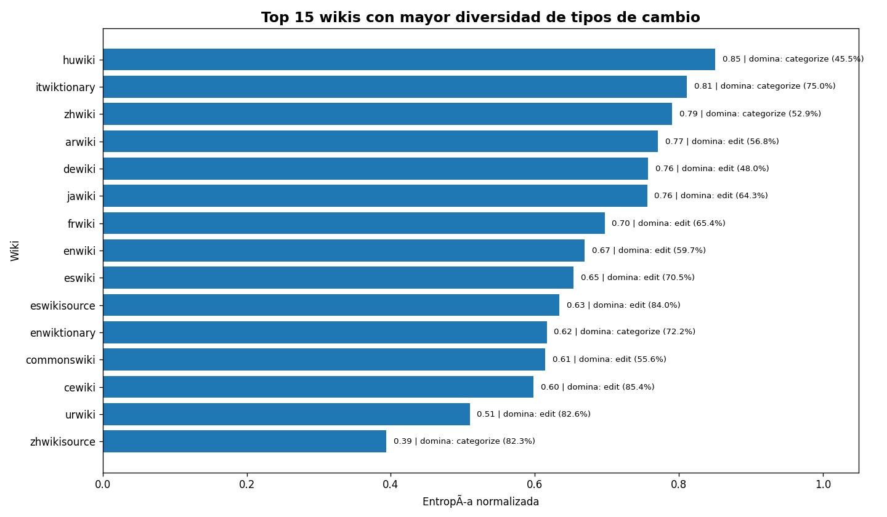
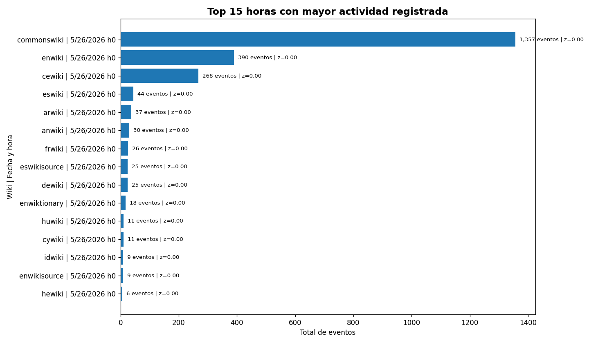
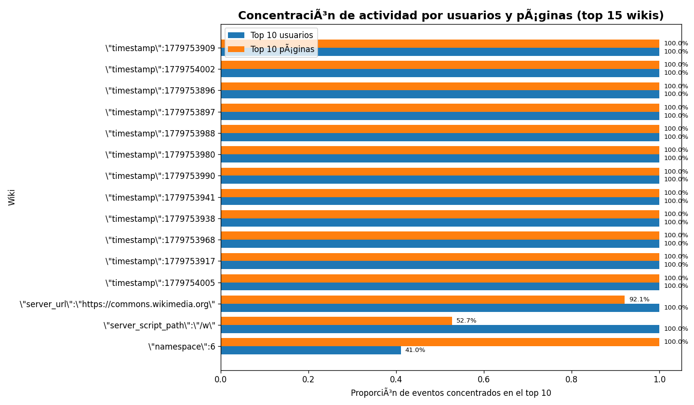
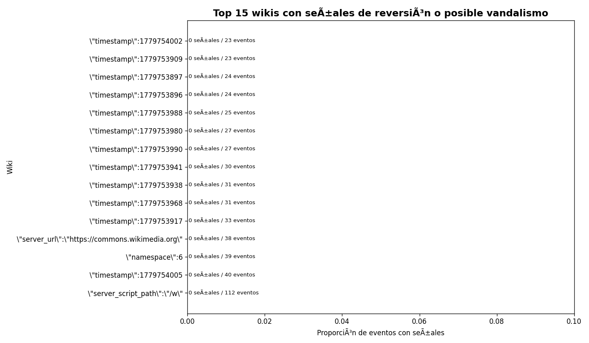

# Etapa 5 - Consultas analíticas integradas

Este documento integra las consultas analíticas de la Etapa 5.

La entrega principal contiene **6 consultas oficiales implementadas en Spark**.  
Adicionalmente, se agregan **7 consultas exploratorias complementarias** en Python/Pandas.

Las consultas complementarias no sustituyen a las oficiales. Su objetivo es ampliar el análisis con preguntas que no estaban cubiertas directamente.

---

## 1. Consultas oficiales implementadas en Spark

| # | Consulta oficial | Pregunta analítica |
|---|---|---|
| Q1 | Top 20 wikis enriquecidas | ¿Dónde se concentra la actividad y qué comunidad es? |
| Q2 | Concentración del tráfico / Pareto | ¿Un pequeño número de wikis concentra la mayor parte del tráfico? |
| Q3 | Wikis bot-dominadas | ¿Qué wikis tienen actividad predominantemente automatizada? |
| Q4 | Top 20 contribuyentes | ¿Quiénes son los usuarios más activos y si son bots o humanos? |
| Q5 | Distribución por familia de proyecto | ¿Cómo se distribuye la actividad entre Wikipedia, Commons, Wikidata y otros proyectos? |
| Q6 | Cobertura del enriquecimiento | ¿Qué porcentaje del stream queda enriquecido con el catálogo estático? |

Las consultas oficiales se ejecutan con `bash scripts/run_etapa5_queries.sh`.

Las visualizaciones oficiales se generan con `python3 scripts/visualize_etapa5.py`.

---

## 2. Comparación con las consultas exploratorias

Se revisaron 9 consultas exploratorias. Para evitar duplicidad con las consultas oficiales, se excluyeron dos:

| Consulta exploratoria original | Decisión | Motivo |
|---|---|---|
| Top wikis por volumen | No se documenta como complementaria | Ya está cubierta por Q1 |
| Bots vs humanos por wiki | No se documenta como complementaria | Ya está cubierta por Q1 y Q3 |

Por lo tanto, se integran únicamente las **7 consultas no repetidas**.

---

## 3. Consultas complementarias no repetidas

Estas consultas se ejecutan con `python3 scripts/visualize_results.py`.

En Windows también pueden ejecutarse con `py .\scripts\visualize_results.py`.

Generan tablas y gráficas en:

- `spark/output/analysis_tables/`
- `spark/output/charts/`

---

## C1. Distribución por tipo de cambio

**Pregunta analítica:**  
¿Qué tipos de cambios son más frecuentes en el stream?

**Valor agregado:**  
Complementa las consultas oficiales porque analiza la naturaleza de las acciones realizadas, no solo la wiki donde ocurren.

---

## C2. Heatmap wiki × tipo de cambio

**Pregunta analítica:**  
¿Qué tipos de cambio predominan en cada wiki activa?

**Valor agregado:**  
Permite observar patrones internos por comunidad. Algunas wikis pueden concentrarse en ediciones, otras en categorizaciones o acciones administrativas.

---

## C3. Índice de automatización por wiki y tipo de cambio

**Pregunta analítica:**  
¿Qué combinaciones de wiki y tipo de cambio están más dominadas por bots?

**Valor agregado:**  
Complementa Q3 porque no solo identifica wikis bot-dominadas, sino combinaciones específicas de wiki y tipo de cambio donde la automatización es más fuerte.

---

## C4. Diversidad por entropía

**Pregunta analítica:**  
¿Qué wikis tienen actividad más diversa y cuáles están dominadas por un solo tipo de cambio?

**Valor agregado:**  
Agrega una métrica de diversidad que no aparece en las consultas oficiales.

---

## C5. Picos anómalos por hora

**Pregunta analítica:**  
¿Qué wikis tuvieron horas con actividad inusualmente alta?

**Valor agregado:**  
Permite detectar picos temporales de actividad que pueden estar relacionados con eventos noticiosos, campañas de edición, bots o vandalismo.

---

## C6. Concentración por usuarios y páginas

**Pregunta analítica:**  
¿La actividad está distribuida entre muchos usuarios y páginas o concentrada en pocos?

**Valor agregado:**  
Complementa Q4. Q4 identifica usuarios activos; esta consulta mide concentración relativa e incorpora también páginas.

---

## C7. Señales de reversión, spam o posible vandalismo

**Pregunta analítica:**  
¿Qué wikis muestran señales de reversión, rollback, spam o posible vandalismo?

**Valor agregado:**  
Agrega análisis de texto no estructurado a partir del campo `comment`, algo que no está cubierto por las consultas oficiales.

---

## 4. Resumen integrado

| Bloque | Número de consultas | Enfoque |
|---|---:|---|
| Consultas oficiales Spark | 6 | Análisis principal, enriquecimiento, Pareto, bots, contribuyentes y familias de proyecto |
| Consultas complementarias | 7 | Tipos de cambio, diversidad, anomalías temporales, concentración y señales de moderación |
| Total integrado | 13 | Análisis operativo, analítico y exploratorio del stream |

---

## 5. Consideración ética

Las consultas C6 y C7 usan datos crudos como usuarios, títulos de páginas y comentarios. Aunque el stream de Wikimedia es público, no se debe subir el archivo completo `recent_changes_raw.csv` al repositorio.

Ese archivo debe usarse únicamente de forma local para reproducir los análisis.