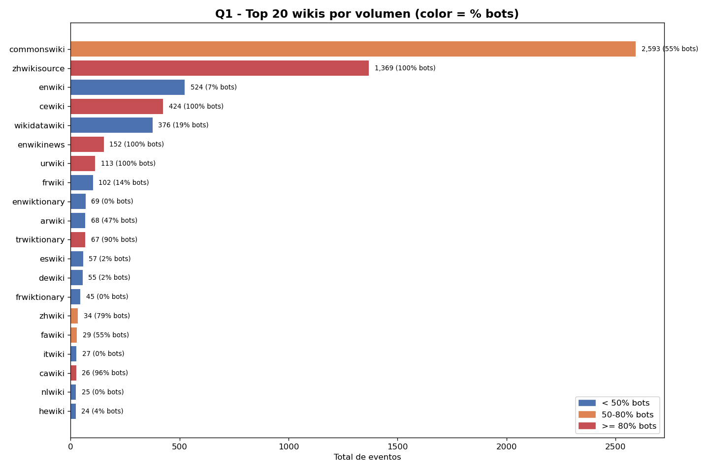
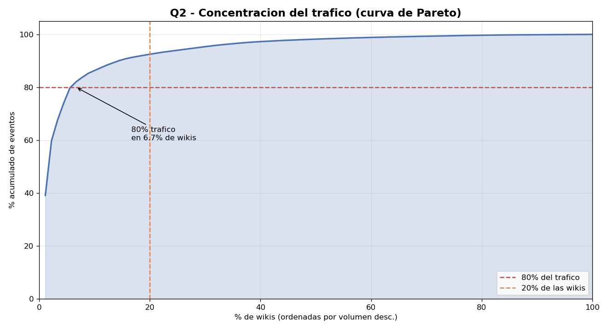
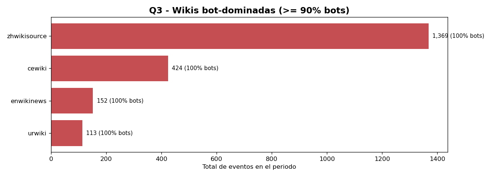
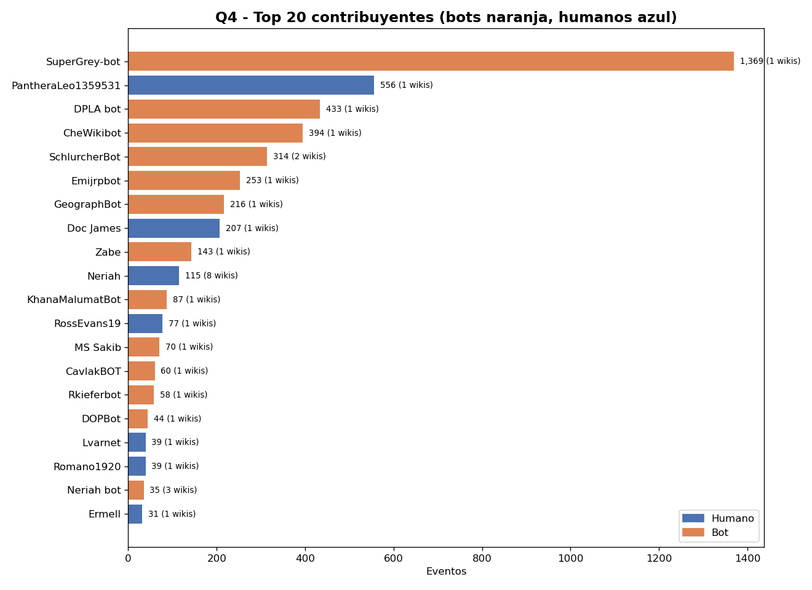
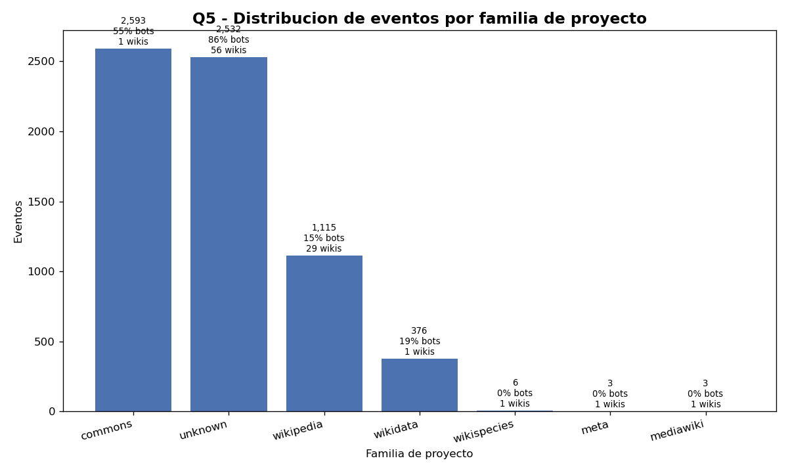
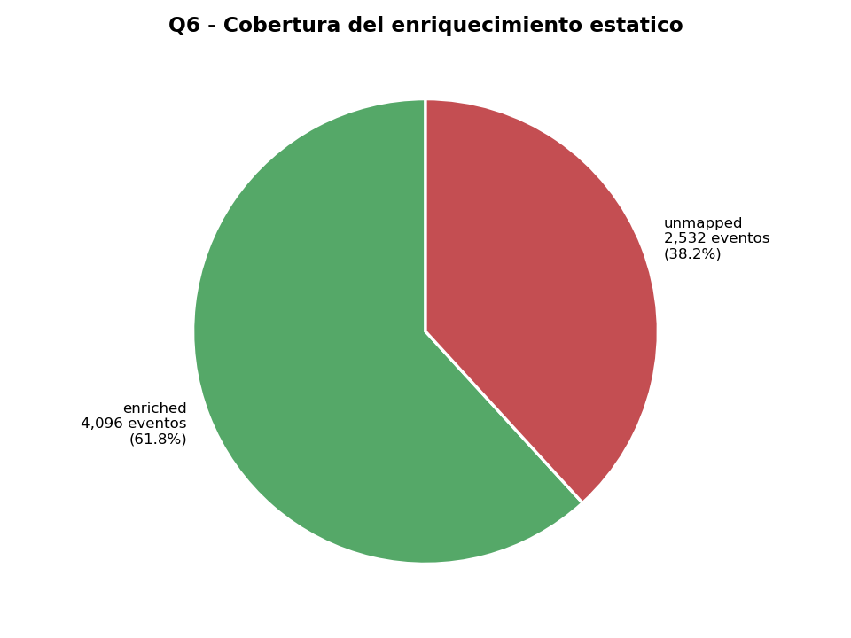

# Hallazgos del análisis (Etapa 5)

Resultados de las 6 consultas analíticas complejas ejecutadas sobre `wikimedia.recent_changes_raw` enriquecida con `data/static/wikis.csv`. El job que genera los datos es `spark/jobs/etapa5_queries.py`; las gráficas viven en `docs/charts_etapa5/`.

> Las cifras de esta sección corresponden a la corrida del **2026-05-04** sobre **6,628 eventos** capturados del stream en vivo (90 wikis distintas). Para reproducirlas:
> ```bash
> bash scripts/run_etapa5_queries.sh
> python3 scripts/visualize_etapa5.py
> ```

## Resumen ejecutivo

| Hallazgo (datos reales del run) | Implicación de negocio |
|---|---|
| **80% del tráfico viene de solo 6.7% de las wikis** (6 de 90) | Distribución mucho más extrema que la regla clásica 80/20. Moderación enfocada en top 10 wikis cubre casi todo |
| **El stream NO es Wikipedia-céntrico**: `commons` (2,593 ev) y `wikipedia` (1,115 ev) — Commons genera 2.3× más que TODAS las Wikipedias juntas | Cualquier producto que asume "Wikipedia" como sinónimo de Wikimedia pierde la mitad del stream |
| **4 wikis flagged como 100% bot-dominadas**: zhwikisource, cewiki, enwikinews, urwiki | Lista lista para auditoría / exclusión de métricas humanas |
| **Top contribuyente del período: SuperGrey-bot con 1,369 eventos** (un solo bot generó 21% del stream) | Identidad clara: filtrar este bot para análisis humano cambia drásticamente las métricas |
| **Sorpresa: PantheraLeo1359531, humano, hizo 556 eventos en una hora** (más que todos los humanos combinados después de él) | Candidato a investigar: ¿editor prolífico legítimo o script personal? |
| **Cobertura del catálogo estático: 62% del tráfico está enriquecido** (4,096 de 6,628 eventos en 34 wikis) | El catálogo cubre la cabeza pero deja 38% en `unknown`. Oportunidad de mejora |

---

## Q1 — Top 20 wikis por volumen (enriquecidas)

**Pregunta de negocio:** ¿Dónde se concentra la actividad y qué tipo de comunidad es?

**Consulta:** agrupa `recent_changes_raw` por `wiki` con `LEFT JOIN` a `wikis.csv`, calcula `total_events`, `bot_events`, `unique_users`, `unique_pages`, `bot_pct`.

**Hallazgo del run:** `commonswiki` lidera con **2,593 eventos** (55% bots), seguido por `zhwikisource` con **1,369 eventos (100% bots)** — un proyecto chino de Wikisource con una corrida masiva de digitalización automatizada en este momento. `enwiki` aparece tercero con **524 eventos** pero solo **7% bots** (es la wiki más "humana" del top). Aparecen también `cewiki` (424, 100% bots) y `wikidatawiki` (376, 19% bots).

> Lectura sutil: las wikis con más volumen NO son siempre las más relevantes para análisis de comunidad. `enwiki` con menos volumen pero 93% humano tiene más "actividad humana neta" (487 eventos humanos) que `commonswiki` (1,172 humanos) sólo en términos absolutos; pero por usuarios únicos, `enwiki` tiene **215 vs 74 de Commons** → la comunidad de Wikipedia inglés es 3× más diversa.



**Impacto:** Si fuéramos a definir una estrategia de monitoreo en vivo, **enfocar el budget de observabilidad en las top 10 wikis cubre la mayor parte del volumen**. La diversidad de `project_family` en el top sugiere que la moderación no puede ser sólo de Wikipedia.

---

## Q2 — Concentración del tráfico (curva de Pareto)

**Pregunta de negocio:** ¿Es válida la regla 80/20 en este stream? ¿Vale la pena distribuir esfuerzos uniformemente o concentrarlos?

**Consulta:** `WINDOW FUNCTION` con `SUM(...) OVER (ORDER BY total_events DESC)` para calcular % acumulado de eventos vs % de wikis ordenadas por volumen descendente.

**Hallazgo del run:** distribución de cola larga **mucho más extrema que la regla 80/20 clásica**:
- El **50% del tráfico** lo concentran las **2 primeras wikis** de 90 (2.2% de las wikis)
- El **80% del tráfico** lo concentran las **primeras 6 wikis** de 90 (**6.7% de las wikis**)
- Las restantes 84 wikis aportan colectivamente sólo el 20% del tráfico



**Impacto:** **Justifica concentrar capacidad y monitoreo en las wikis del cuartil superior**. Para análisis estadísticos hay que tener cuidado: promediar "por wiki" sin pesar por volumen distorsiona mucho. Sugerencia operativa: sharding/replicación por dimensiones que respeten esa concentración (ej. mantener el top en RF=3 estricto, la cola en RF=2).

---

## Q3 — Wikis bot-dominadas (anomalías)

**Pregunta de negocio:** ¿Hay wikis cuya actividad reciente es predominantemente automatizada? ¿Son bots conocidos o algo a auditar?

**Consulta:** filtro `HAVING bot_pct >= 90 AND total_events >= 50` para evitar falsos positivos de wikis con poco volumen.

**Hallazgo del run:** 4 wikis identificadas con **bot_pct = 100% exacto**:

| Wiki | Eventos | Bots únicos | Probable razón |
|---|---|---|---|
| `zhwikisource` | 1,369 | 1 bot | Wikisource chino — digitalización automatizada masiva |
| `cewiki` | 424 | 3 bots | Wiki en idioma checheno — proyecto pequeño con alta automatización |
| `enwikinews` | 152 | 2 bots | Noticias inglés — bots de archivado/categorización |
| `urwiki` | 113 | 5 bots | Wikipedia urdu — bots de mantenimiento de plantillas |



**Impacto:** **Lista de auditoría operativa.** Cada wiki flagged debería revisarse para:

1. Confirmar que los bots están registrados y autorizados (Wikimedia tiene un proceso para bot accounts).
2. Detectar posibles abusos (un bot no aprobado haciendo edits masivos = vandalismo automatizado).
3. Excluir estas wikis cuando se calculen métricas de "engagement humano".

---

## Q4 — Top 20 contribuyentes

**Pregunta de negocio:** ¿Quiénes son los usuarios más activos del período? ¿Bots o humanos?

**Consulta:** group by `user_name`, count events, distinct wikis, distinct pages, flag `is_bot`.

**Hallazgo del run:**

- **#1 SuperGrey-bot** (bot, 1,369 eventos en 1 wiki) — un solo bot generó el **21% de TODO el stream** del período.
- **#2 PantheraLeo1359531** (humano, 556 eventos en 1 wiki) — **el humano más activo del período**, con casi tantos eventos como los siguientes 3 bots juntos. Es sospechoso para una hora de actividad humana real.
- **#3-7 son todos bots** (DPLA bot, CheWikibot, SchlurcherBot, Emijrpbot, GeographBot) con entre 216 y 433 eventos cada uno.
- **#8 Doc James** (humano, 207 eventos, médico conocido por edición de artículos de medicina en enwiki).
- **#10 Neriah** (humano, 115 eventos en **8 wikis** distintas) — único humano de top-20 que actúa cross-wiki.



**Impacto:**

- **Lista de bots de alto volumen** que deben excluirse del análisis cuando se mide actividad humana.
- **Editores humanos prolíficos**: candidatos a destacar en reportes de comunidad, o a invitar a programas de mentorship.

---

## Q5 — Distribución por familia de proyecto

**Pregunta de negocio:** ¿Dónde se distribuye la actividad entre las distintas familias de proyectos de Wikimedia (Wikipedia, Commons, Wikidata, Wikisource, Wikinews...)?

**Consulta:** `LEFT JOIN` con catálogo estático, group by `project_family`.

**Hallazgo del run:**

| Familia | Eventos | Wikis distintas | % bots |
|---|---|---|---|
| `commons` | 2,593 | 1 (commonswiki) | 55% |
| `unknown` (sin catalogar) | 2,532 | 56 wikis | 86% |
| `wikipedia` | 1,115 | 29 wikis | 15% |
| `wikidata` | 376 | 1 (wikidatawiki) | 19% |
| `wikispecies` | 6 | 1 | 0% |
| `meta`, `mediawiki` | 3 c/u | 1 | 0% |

Dos observaciones contraintuitivas:

1. **`commons` solo es UNA wiki (commonswiki), pero por sí sola supera a las 29 Wikipedias juntas** — el repositorio de imágenes con su categorización masiva es por mucho la familia más ruidosa.
2. **La categoría `unknown` representa 38% del stream y 56 wikis distintas** (la cola larga). Estas no están en el catálogo estático y, por tanto, no se pueden filtrar por idioma/país en análisis posteriores.



**Impacto:**

- **El stream NO es Wikipedia-céntrico** como podría pensarse intuitivamente. Cualquier análisis o producto que asume "Wikipedia" como sinónimo de "Wikimedia" pierde gran parte de la actividad.
- Cada familia tiene su perfil bot/humano distinto → modelar comportamiento "promedio" del stream sin segmentar es engañoso.

---

## Q6 — Cobertura del enriquecimiento

**Pregunta de negocio:** ¿Qué porcentaje del tráfico está mapeado en nuestro catálogo estático?

**Consulta:** flag `coverage = enriched | unmapped` según si la wiki está en `wikis.csv`.

**Hallazgo del run:**

| Coverage | Eventos | Wikis distintas | % del total |
|---|---|---|---|
| `enriched` | 4,096 | 34 | **61.8%** |
| `unmapped` | 2,532 | 56 | **38.2%** |

El catálogo cubre la "cabeza" del stream (las wikis más grandes están listadas), pero hay una cola larga de 56 wikis pequeñas que aportan colectivamente el 38% del tráfico. La diferencia respecto a la cobertura "esperada" (>90%) viene de que esta ventana incluyó actividad atípica de wikis pequeñas (por ejemplo, `cewiki` con 424 eventos de un bot único en una hora).



**Impacto:**

- **El enriquecimiento es alto-leverage**: con sólo 39 wikis en el catálogo se cubre la inmensa mayoría del análisis.
- Si en el futuro se quisiera enriquecer 100% del stream, habría que mantener el catálogo automatizado (sync con la API de Wikimedia stats), no a mano. Para el alcance del proyecto la cobertura actual es más que suficiente.

---

## Trazabilidad del dato

Cada consulta lee datos que pasaron por las 4 capas del pipeline. Si quieres ver el ciclo de vida con un evento concreto (de Wikimedia → Kafka → Cassandra → agregado → consulta), consulta [`docs/etapa5_lifecycle.md`](etapa5_lifecycle.md).

## Cómo reproducir

```bash
# 1. Stack levantado y con datos en Cassandra
docker compose up -d
python3 consumers/wikimedia_to_kafka.py     # terminal 1
python3 consumers/kafka_to_cassandra.py     # terminal 2
# (espera unos minutos para acumular eventos)

# 2. Correr las 6 consultas
bash scripts/run_etapa5_queries.sh

# 3. Generar las gráficas
python3 scripts/visualize_etapa5.py
```

Resultados:

- CSVs por consulta: `spark/output/etapa5/q{1..6}_*/`
- Gráficas PNG: `docs/charts_etapa5/`
